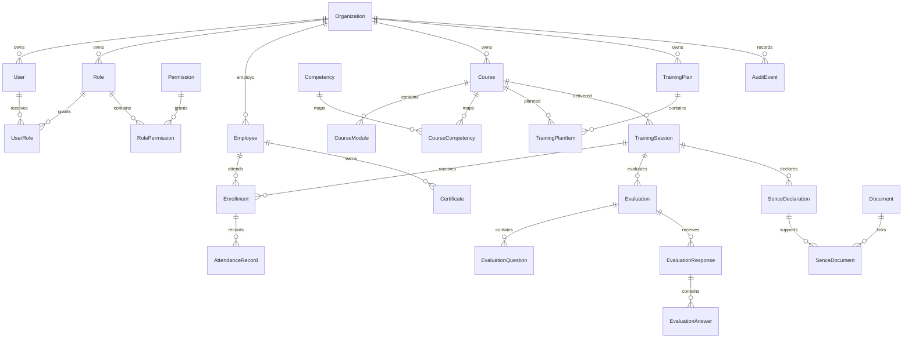

# SkillFlow AI Data Model

This document summarizes the current SkillFlow AI PostgreSQL data model defined in `prisma/schema.prisma`.

## Core Principles

- All persisted records use UUID identifiers.
- Tenant-owned operational records include `organizationId`.
- Core tables include `createdAt`, `updatedAt`, `deletedAt`, and `version`.
- Soft-deleted records are filtered by repositories.
- Production may require PostgreSQL partial unique indexes for some soft-delete-aware uniqueness rules.

## Main Entities

### Organization

Represents a client company, OTEC, provider, holding, or internal tenant root.

Key relationships:
- Users, roles, employees, providers, courses, competencies, training plans, sessions, enrollments, documents, notifications, reports, and audit events.

### Identity And Access

Entities:
- `User`
- `Role`
- `Permission`
- `UserRole`
- `RolePermission`

Purpose:
- Authenticate users.
- Scope users to an organization.
- Authorize actions through permission codes such as `users.read`, `employees.create`, and `training_plan.approve`.

### Workforce Management

Entity:
- `Employee`

Purpose:
- Store employee identity, document number, contact information, department, area, position, status, and training relationships.

### Learning Catalog

Entities:
- `Course`
- `CourseModule`
- `Competency`
- `CourseCompetency`

Purpose:
- Manage training catalog, course modalities, duration, SENCE codes, and competency mappings.

### Training Planning

Entities:
- `TrainingPlan`
- `TrainingPlanItem`

Purpose:
- Manage annual training plans, budgets, yearly planning, priorities, planned courses, and estimated participants/costs.

### Training Execution

Entities:
- `TrainingSession`
- `Enrollment`
- `AttendanceRecord`

Purpose:
- Schedule training sessions, enroll employees, and register attendance evidence.

Implementation status:
- Training sessions, enrollments, and attendance records are implemented as HTTP modules.
- Attendance metrics are calculated from `checkInAt`, `checkOutAt`, and the session duration. The current schema does not persist calculated attendance minutes or percentage.

### Assessment And Certification

Entities:
- `Evaluation`
- `EvaluationQuestion`
- `EvaluationResponse`
- `EvaluationAnswer`
- `Certificate`

Purpose:
- Model evaluations, participant answers, scores, approval, certificates, and verification metadata.

Implementation status:
- Evaluations, evaluation questions, evaluation responses, and evaluation answers are implemented as HTTP modules.
- Evaluations use `closedAt` for logical closing; `deletedAt` remains reserved for soft delete.
- Evaluation results calculate raw score, max score, percentage, and passed status from question points and submitted answers.
- The current schema stores raw score in `EvaluationResponse.score`; `maxScore` and `percentage` are returned by the result endpoint but are not persisted as separate columns.
- Certificates are implemented as an HTTP module and are issued only when enrollment, attendance, and evaluation eligibility rules pass.
- Certificate revocation uses `status = REVOKED`, `revokedAt`, and `revokedReason`; `deletedAt` remains reserved for administrative soft delete.
- Certificate verification is public and returns limited certificate metadata without sensitive employee PII.
- Certificate document generation currently creates `Document` metadata with a local stub storage key; real PDF rendering and cloud storage are intentionally pending.

### SENCE Compliance And Documents

Entities:
- `SenceDeclaration`
- `SenceDocument`
- `Document`

Purpose:
- Track SENCE declarations, related evidence, document metadata, storage keys, and file ownership.

Implementation status:
- SENCE declarations and SENCE documents are implemented as HTTP modules for compliance foundation workflows.
- SENCE submission is a manual local stub. It records `status = SUBMITTED`, `submittedAt`, and `responsePayload.submissionMode = MANUAL_STUB`; it does not call external SENCE APIs.
- Compliance validation derives attendance, certificate, and evaluation consistency from the training session graph.
- Evidence generation returns logical DTO metadata for session, participants, attendance, certificates, evaluations, course, and instructor data. It does not generate PDFs or physical files.
- `Document` remains a metadata/stub model without persistent status.

### Reporting, Notifications, And Audit

Entities:
- `Notification`
- `ReportSnapshot`
- `AuditEvent`

Purpose:
- Store user notifications, dashboard/report snapshots, and immutable audit events for sensitive operations.

## Conceptual ERD

## Current Implementation Coverage

Implemented HTTP modules:
- Auth
- Organizations
- Users
- Employees
- Courses
- Training Plans
- Instructors
- Training Sessions
- Enrollments
- Attendance
- Evaluations
- Certificates
- SENCE declarations

Schema-only modules:
- Providers
- Documents
- Reports
- Notifications
- Audit event listing
- AI Copilot persistence
